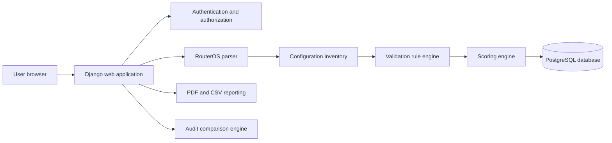
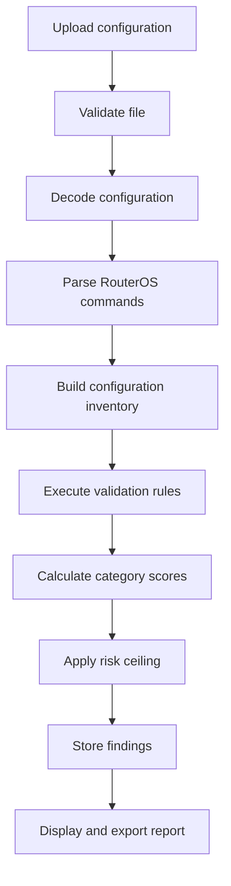
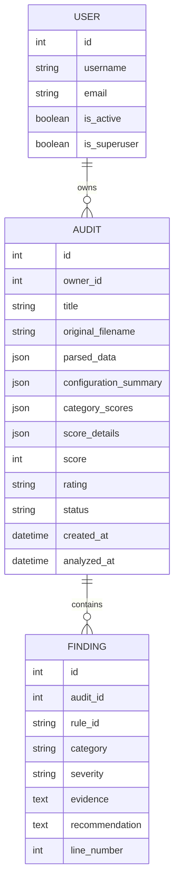

# NetAudit Project Documentation

## 1. Project title

Design and Development of a Web-Based MikroTik RouterOS Configuration Audit and Risk Assessment System.

## 2. Problem statement

MikroTik configuration exports may contain overlapping networks, invalid DHCP ranges, exposed management services, unsafe firewall ordering, conflicting NAT rules, invalid route gateways, and references to undefined interfaces. Manual review takes time and depends on the reviewer’s experience. NetAudit provides a structured audit and risk assessment workflow for RouterOS `.rsc` exports without requiring live router credentials.

## 3. Main objective

To design and implement a web-based decision-support system that parses MikroTik RouterOS configuration exports, detects common network and security misconfigurations, calculates explainable risk scores, and provides remediation guidance.

## 4. Specific objectives

1. Parse section-based and terse RouterOS export syntax.
2. Build structured inventories of interfaces and configuration objects.
3. Detect IP, DHCP, firewall, NAT, route, service, and Layer-2 management risks.
4. Calculate overall and category-specific audit scores.
5. Generate PDF and CSV reports.
6. Compare baseline and current audits.
7. Evaluate detection performance through precision, recall, F1 score, and processing time.

## 5. Intended users

- Junior network administrators
- Network students and training centres
- Small institutional IT teams
- MikroTik consultants
- Small ISP support teams

## 6. Scope

NetAudit analyzes uploaded `.rsc` and `.txt` configuration exports. It does not connect to routers, store router passwords, execute commands, monitor live traffic, or guarantee full security compliance.

## 7. User roles

### Normal user

- Upload configurations
- View personal audits
- Export reports
- Reanalyze configurations
- Compare personal audits
- Delete personal audits

### Administrator

- Manage users
- View all audits
- Reanalyze or delete audits
- Review registered rules
- View system-wide statistics

## 8. Functional requirements

- Account registration and login
- Role-based authorization
- Configuration upload validation
- RouterOS parsing
- Rule-based validation
- Risk scoring
- Audit history
- PDF and CSV export
- Audit comparison
- Custom administration
- Rule documentation

## 9. Non-functional requirements

- Authentication and ownership isolation
- No direct router credentials
- Maximum upload limit
- Secure production cookies
- HTTPS-compatible deployment
- Explainable findings
- Responsive interface
- Deterministic rule evaluation
- Automated test coverage
- Processing-time measurement

## 10. System architecture

## 11. Main audit workflow

## 12. Database relationship

## 13. Core algorithms

### RouterOS parsing

The parser reads logical lines, joins multiline commands, detects configuration sections, tokenizes quoted values, separates commands from properties, normalizes values, and preserves source line numbers.

### Network overlap detection

Each normalized network is compared against other networks using IP version and subnet-overlap operations.

### Firewall shadowing

An earlier terminal rule covers a later rule when both use the same chain and every earlier matching condition is equal to or broader than the later condition.

### Route gateway resolution

A gateway is valid when it is reachable through a connected network or through a recursively resolvable non-default route in the appropriate routing table.

### Risk scoring

Each finding receives a base severity penalty. The penalty is multiplied by category importance and reduced for repeated occurrences. Category scores are aggregated into an overall score. Critical findings apply a maximum score ceiling.

## 14. Security controls

* Django password hashing
* CSRF protection
* Login-required routes
* Ownership-filtered audit retrieval
* Administrator-only management views
* Secure production cookies
* HSTS support
* No router credential storage
* No automatic configuration execution

## 15. Limitations

* Analysis quality depends on export completeness.
* Vendor-specific behavior outside the implemented rules may not be detected.
* Partial exports can limit reference validation.
* The tool does not replace professional network review.
* No live network state or packet data is analyzed.

## 16. Evaluation

The evaluation dataset contains secure, insecure, DHCP-conflict, route-risk, firewall-risk, NAT-risk, security-services-risk, reference-integrity, partial-export, and remediated configurations. Expected rule labels are stored in the manifest before running the evaluator.

Metrics:

* True positives
* False positives
* False negatives
* Precision
* Recall
* F1 score
* Accuracy
* Average processing time

## 17. Future enhancements

* CVE correlation
* RouterOS version awareness
* Additional IPv6 validation
* Configuration dependency graph visualization
* Multi-vendor configuration support
* Optional read-only RouterOS API integration
## 18. System-level enhancements implemented

To present NetAudit as a complete audit system rather than a collection of features, the application includes six system-level components:

1. Expanded evaluation dataset with ten labeled RouterOS configuration cases.
2. Public methodology page describing parse, inventory, rule, score, report, and evaluation stages.
3. Rule knowledge-base directory that acts as a traceability matrix for the analyzer.
4. Audit-detail inventory views for interfaces, IP addresses, DHCP, services, firewall, NAT, and routes.
5. Explainable score breakdown showing raw score, risk ceiling, final score, repeat adjustment, and sample penalties.
6. Baseline/current comparison framed as remediation progress with resolved, new, and unchanged findings.
<!-- Maintenance review completed. -->

<!-- Maintenance review completed. -->

<!-- [rev-6884] Docs updated 23 Aug 2026 -->
